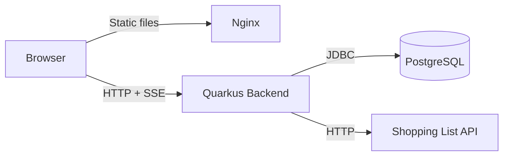

# Meet — Architecture

## Overview

Meet is an online meeting planner. Groups use it in two stages:

1. **Scheduling** — Find a meeting time via simple voting (Doodle-style) or availability grid (When2meet-style)
2. **Planning** — Once a time is locked, coordinate details with polls, checklists, comments, and shopping lists

Participation is flexible: guests join with a passphrase and display name, or optionally create an account.

## System Diagram



## Tech Stack

| Layer | Technology |
|-------|-----------|
| Backend | Kotlin 2.3, Quarkus 3, JVM 21 |
| Database | PostgreSQL 17, Flyway migrations, jOOQ code generation |
| Frontend | SvelteKit 2 (SPA/static), Svelte 5, TypeScript |
| UI | Skeleton UI v4, Tailwind CSS v4 |
| Testing | Kotest + Testcontainers (backend), Vitest (frontend), Playwright (E2E) |
| Deployment | Docker Compose, Nginx |

## Project Structure

```
meet/
├── backend/
│   ├── src/main/kotlin/com/meet/
│   │   ├── auth/            # User registration, login, JWT
│   │   ├── event/           # Event CRUD, lifecycle, participants
│   │   ├── scheduling/      # Time options, voting
│   │   ├── poll/            # Polls and voting
│   │   ├── checklist/       # Checklist items
│   │   ├── comment/         # Comments
│   │   ├── shoppinglist/    # Shopping list integration (external API)
│   │   ├── sse/             # Server-Sent Events pub/sub
│   │   └── config/          # Configuration classes
│   ├── src/main/resources/
│   │   ├── db/migration/    # Flyway SQL migrations
│   │   └── application.properties
│   └── build.gradle.kts
├── frontend/
│   ├── src/
│   │   ├── routes/          # SvelteKit pages
│   │   └── lib/
│   │       ├── api/         # Typed API client + SSE helper
│   │       ├── components/  # Svelte components
│   │       └── stores/      # Auth and event state
│   └── package.json
├── e2e/                     # Playwright E2E tests
├── docs/ARCHITECTURE.md     # This file
├── docker-compose.yml       # Production
├── docker-compose.dev.yml   # Dev database
└── justfile                 # Task runner
```

## Data Model

The database schema is defined in `backend/src/main/resources/db/migration/V1__create_schema.sql`.

Core entities: `users`, `events`, `event_participants`, `time_options`, `time_votes`, `polls`, `poll_options`, `poll_votes`, `checklist_items`, `comments`, `event_shopping_lists`.

## API

The backend exposes a REST API documented via OpenAPI/Swagger. Run the backend in dev mode and browse the full API:

```bash
just dev-backend
# Visit http://localhost:8080/q/swagger-ui
```

## Authentication & Authorization

Three access mechanisms:

- **Admin token** — UUID generated at event creation, passed via `X-Admin-Token` header. Grants organizer control (edit event, manage time options, configure permissions).
- **Passphrase** — Hashed and stored on the event. Participants enter it to join without an account.
- **JWT Bearer token** — Issued on login/register, passed via `Authorization` header. Used for account features (dashboard, linking participation to profile).

**Permission flags** on each event control what participants can do:
- `participants_can_poll` — Create polls (default: true)
- `participants_can_checklist` — Create checklist items (default: true)
- `participants_can_shopping_list` — Create shopping lists (default: false)

## Real-time Updates

The backend uses Server-Sent Events (SSE) for live updates. Clients subscribe to `/api/events/{id}/stream` and receive JSON events when state changes.

Event types: `event-updated`, `participant-joined`, `time-options-added`, `vote-cast`, `time-decided`, `poll-created`, `poll-vote`, `checklist-item-added`, `checklist-item-updated`, `comment-added`, `shopping-list-added`, `shopping-list-removed`.

The pub/sub is in-memory (no external broker), suitable for single-instance deployments.

## External Integrations

**Shopping List API** — Meet calls an external service (configurable via `SHOPPING_LIST_API_URL`, default `https://liste.jpro.dev`) to create shared shopping lists. Meet stores only the `share_token` and `widget_url` references. The frontend loads a `<shopping-list-widget>` web component from the external domain.

## Testing

- **Backend**: Kotest + JUnit 5 with `@QuarkusTest`. Testcontainers auto-starts PostgreSQL. Run: `cd backend && ./gradlew test`
- **Frontend**: Vitest + `@testing-library/svelte`. Run: `cd frontend && npx vitest run`
- **E2E**: Playwright with containerized backend. Run: `just test-e2e`

## Development

**Prerequisites:** JDK 21, Node.js, Docker

**Start everything:**

```bash
just dev
```

This starts the backend (Quarkus dev mode with hot reload) and frontend (SvelteKit HMR). PostgreSQL starts automatically via Testcontainers/DevServices — no manual DB setup needed.

**Common commands:**

| Command | Description |
|---------|-------------|
| `just dev` | Start backend + frontend |
| `just test` | Run all tests |
| `just fix` | Format and lint all code |
| `just check` | Type-check frontend |
| `just jooq-codegen` | Regenerate jOOQ classes after schema changes |
| `just test-e2e` | Run Playwright E2E tests |

## Deployment

Production runs via Docker Compose (`docker-compose.yml`):

- **PostgreSQL 17** — persistent volume, health-checked
- **Backend** — Quarkus native image, connects to PostgreSQL
- **Frontend** — Static SvelteKit build served by Nginx on port 3000
